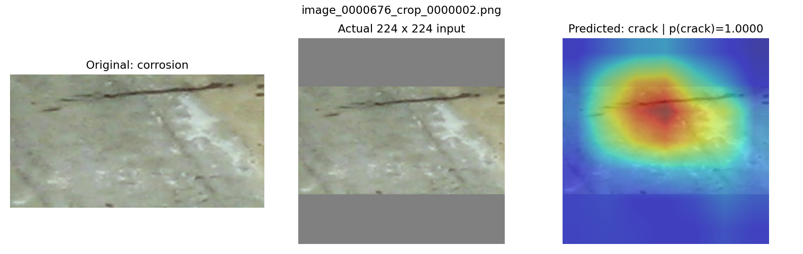
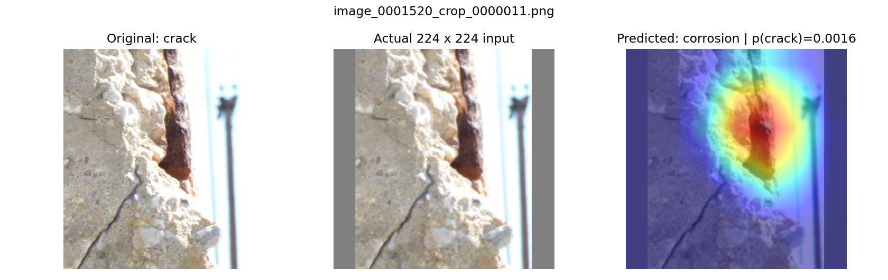
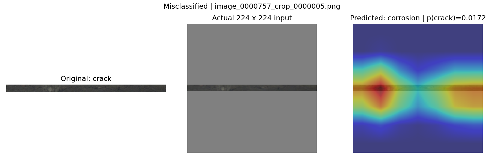

# Concrete damage classification

Classify a supplied concrete crop as **corrosion (0)** or **crack (1)**. The EDF exercise covers data preparation, model training, evaluation and explanation. This dataset contains damage crops, with no healthy-surface class.

## Run the project

```bash
python -m pip install -r requirements.txt
jupyter lab main.ipynb
```

Set `DATA_DIR` to the folder containing images and `labels.csv`, then restart and run all cells.

- `RUN_TRAINING = False`: load the supplied neural-network weights from `models/`. Load LightGBM, or fit it if missing.
- `RUN_TRAINING = True`: train Small CNN from scratch, fine-tune ImageNet ResNet-18 and fit LightGBM.

Model weights are included in `models/`. New weights, plots and the extractable error CSV go in `output/`. Metrics appear in the notebook.

## Workflow

1. Match 3,590 image-label pairs; log three missing images and two unlabelled images.
2. Use the saved seed-42 source-group split: **2,512 train / 346 validation / 732 test**. Crops from one source stay together.
3. Retain 3,244 reviewed training slices, exclude 953 uncertain candidates, and generate three seeded orientations per original or retained slice: **17,268 training samples**. Images are rendered on demand.
4. Train or load the two networks. Validation macro-F1 selects checkpoints; model thresholds are 0.5.
5. Compute 49 colour, texture and edge features from original crops and fit LightGBM. Evaluate all three models and inspect ResNet-18 Grad-CAM examples.

`main.ipynb` shows the steps; `src/` holds reused functions; `support/` contains split and slice decisions. Runtime files stay in `output/`; the three illustrations below are kept in `reports/figures/` for this README.

## Results

Same 732 test crops, including 288 corrosion and 444 crack images, at threshold 0.5:

| Model | Accuracy | Macro-F1 | ROC-AUC | Crack PR-AUC | Errors |
|---|---:|---:|---:|---:|---:|
| **ResNet-18** | **96.04%** | **0.9579** | **0.9873** | **0.9915** | **29** |
| Small CNN | 90.57% | 0.8982 | 0.9562 | 0.9575 | 69 |
| LightGBM | 90.98% | 0.9048 | 0.9737 | 0.9833 | 66 |

ResNet-18 finds **440/444 cracks** (99.10% recall), misses four cracks and predicts crack for 25 corrosion crops. The notebook includes both classes' precision, recall, F1, support and confusion matrices. Exact metrics and confusion matrices are in [results.json](reports/results.json).

These are internal results: the test material has appeared in earlier work.

## Why ResNet-18?

We explored saturation, exposure and brightness normalization during data augmentation, an additional mask channel during training, edge-extraction operators and YOLO. These approaches did not clearly outperform ResNet-18, so we kept it as the final model.

## ResNet-18 error examples

Each panel shows the original crop, padded input and predicted-class Grad-CAM. The coarse heatmaps help interpret three different failure modes.

### 1. A line resembles a crack

`image_0000676_crop_0000002.png`: **corrosion predicted as crack**, p(crack) = **1.0000**, rounded.

A thin dark line crosses the upper crop. Activation overlaps its centre and the surface below, suggesting confusion between a linear surface feature and a crack.



### 2. Crack and corrosion cues coexist

`image_0001520_crop_0000011.png`: **crack predicted as corrosion**, p(crack) = **0.0016**.

A diagonal crack appears at lower left, alongside exposed rusty material on the right. Activation concentrates on the rusty region. The stronger corrosion cue may outweigh the crack in this mixed-damage crop.



### 3. Resizing removes useful detail

`image_0000757_crop_0000005.png`: **crack predicted as corrosion**, p(crack) = **0.0172**.

The 1,082 x 51 crop becomes only **224 x 11 pixels** inside the square input. Fine crack detail is difficult to retain. Activation covers parts of the narrow band and nearby padding, consistent with an input-resolution limitation. Higher resolution or multi-crop inference could be compared on validation data.



All mistakes remain available through `resnet_errors` and its CSV. The notebook displays correct and incorrect examples without printing the full list.
